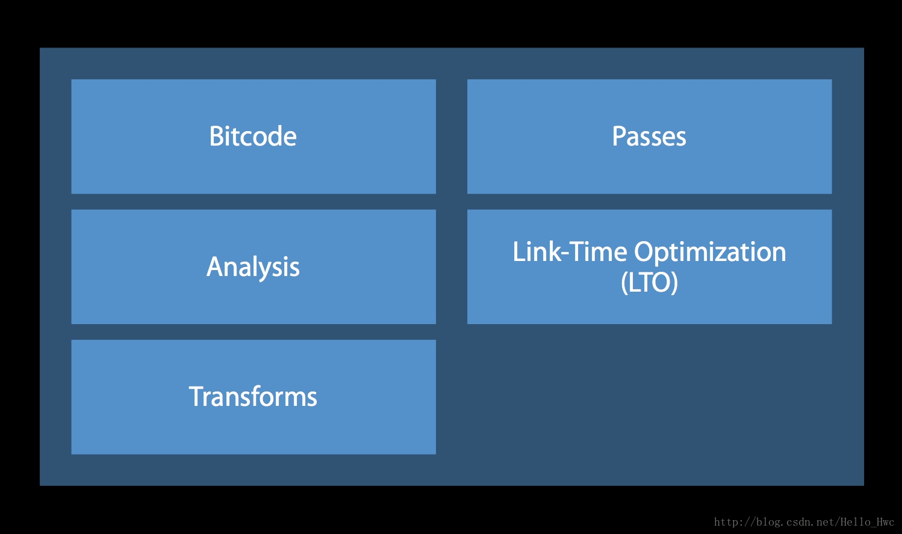
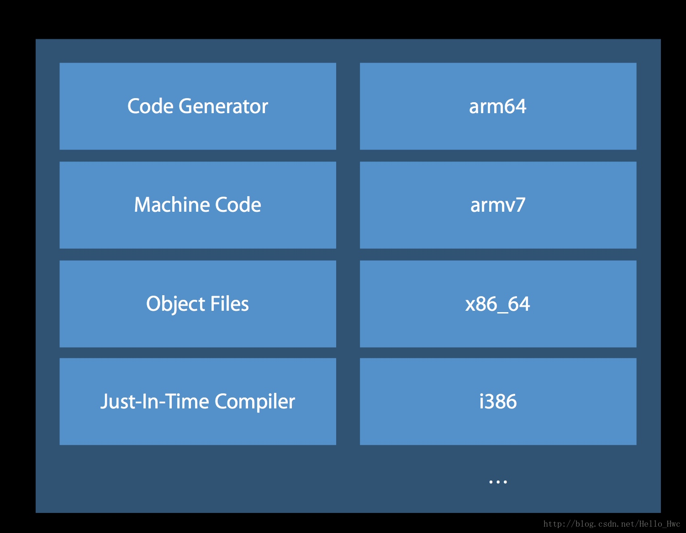

Clang作为编译器的前端
LLVM（Low Level vritual machine）作为编译器的后端

### 编译器前端（Clang）

> 负责语法分析，语义分析，生成中间代码，这个过程会进行类型检查，如果发现错误或者警告就会标注出来在哪一行

###编译器后端（LLVM）

> 进行机器无关的代码优化，生成机器语言，并且进行机器相关的代码优化。后端的处理如下

1. LLVM优化器会进行BitCode的生成，链接期的优化等等

2. LLVM机器码生成器会针对不同的架构，比如arm64生成不同的机器码

##执行一次XCode build的流程

1. 编译信息写入辅助文件，创建编译后的文件架构（name.app）
2. 处理文件打包信息
3. 执行CocoaPod编译前脚本
    - 例如对于使用CocoaPod的工程会执行CheckPods Manifest.lock
4. 编译各个.m文件，使用CompileC和clang命令
5. 链接需要的Framework
6. 编译xib文件
7. 拷贝xib，图片等资源文件到结果目录
8. 编译ImageAssets
9. 处理info.plist
10. 执行CocoaPod脚本
11. 拷贝Swift标准库
12. 创建.app文件并对其签名

 

