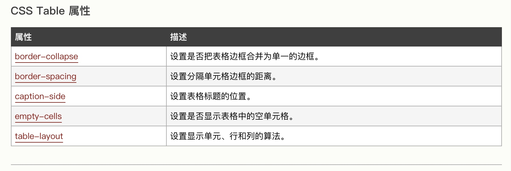

[TOC]

# CSS选择器

```
// 标签选择器 所有p的标签都使用该样式
p {
    font-size:12px;
    line-height:1.6em;
    }

// 类选择器
.stress {
    color:red;
}

// 标签选择器
#stress {
    color:red;
}

// 子选择器 作用于calss名为food的li子元素。
.food>li{
    border:1px;
    solid red;}
    
// 后代选择器 作用于class名为first的所有span元素
.first span{color:red;}

// 通用选择器 作用于当前文件下的所有标签
* {color:red;}

// 伪类选择符 给标签的某种状态设置样式（hover：鼠标划过时）
a:hover{color:red;}

// 分组选择符
h1,span{color:red;}
```

#CSS盒模型

## 元素分类

- 内联元素
>
>`<span>、<a>、<label>、 <strong> 和<em>`就是典型的内联元素（行内元素）（inline）元素。
>1. 内联元素和其他元素都在同一行上
>2. 元素的`宽高顶部底部的边距`不可设置
>3. 元素的宽度就是他包含的文字、图片的宽度，不可改变


- 块级元素
>
>`<div>、 <p>、<h1>、<form>、<ul> 和 <li>`就是块级元素
>1. 每一个块级元素都会独占一行，并且其后的元素也另起一行
>2. 元素的宽高、行高、边距都可设置
>3. 元素的宽度不设置的情况是该父容器的100%（和父元素宽度一致）


- 内联元素设为块级元素

```
a{display:block;}
```

- 块级元素设为内联元素

```
div{
     display:inline;
 }
```

- 内联块状元素
>
>1. 和其他元素都在同一行上
>2. 元素的宽高位置都可设置
>
```
div{
     display:inline-block;
 }
```

- 边框

```
// 宽度 样式（虚线/实线）颜色
p{border:2px dotted #ccc;}
p{border:2px solid #ccc;}
```

#CSS布局模型

##流动模型（Flow）
>
默认网页布局模式，**块状元素**都会在所处的包含元素内**自上而下按顺序垂直延伸分布**。
**内联元素**都会在所处的包含元素内**从左到右水平分布**显示。

##浮动模型（Float）
>
将块状元素设置为浮动模型后不会独占一行


```
div{
    width:200px;
    height:200px;
    border:2px red solid;
    float:left;
}
```

##层模型
>
类似photoshop的图层编辑功能。
层模型有三种模式：绝对定位(position:absolute)，相对定位(position:relative)，固定定位(position:fixed)

- 绝对定位

>
将元素从文档流中拖出来，然后使用left、right、top、bottom属性相对于其最接近的一个具有定位属性的**父包含块**进行绝对定位


```
#div1{
    width:200px;
    height:200px;
	border:2px red solid;
	position:absolute;
	top:20px;
	right:40px;
}
```

- 相对定位

>
>它通过left、right、top、bottom属性确定元素在**正常文档流**中的偏移位置。

```
#div1{
    width:200px;
    height:200px;
    border:2px red solid;
    position:relative;
    left:20px;
}
```

- 固定定位

>
>固定显示在浏览器窗口的某个位置，不会随页面滚动而改变位置（常见的网页广告窗口）

```
#div1{
    width:200px;
    height:200px;
	border:2px red solid;
	position:fixed;
	bottom:20px;
}
```

- 相对父控件绝对定位

>想实现这个效果需把父控件设为position:relative，自身控件设为position:absolute

```
.App-list {
    flex: 8;
    background-color: #00ffff80;
    position:relative;
}

.App-test {
    background-color: #22222280;
    width:200px;
    height:200px;
    position: absolute;
    right:20px;
}
```

#单位和值

- 颜色值

```
p{color:red;}

p{color:rgb(133,45,200);}

p{color:rgb(20%,33%,25%);}

p{color:#00ffff;}

p{color:#0ff;}

// 需要设置透明度的
p{color:#00ffff80;}

p{color:rgba(133,45,200,0.5);}

```

- 长度值

- px: 像素

- em：
>
>如果元素的 font-size 为 14px ，那么 1em = 14p
>

```
// 段落首行缩进 24px（也就是两个字体大小的距离）
p{font-size:12px;text-indent:2em;}

// 当给 font-size 设置单位为 em 时，此时计算的标准以 p 的父元素的 font-size 为基础。
p{font-size:14px}
span{font-size:0.8em;}
```
 
- 百分比
>
>设置行高（行间距）为字体的130%（12 * 1.3 = 15.6px）。

```
p{font-size:12px;line-height:130%}
```

#水平居中

- 水平居中-行内元素

```
<!--只需设置父控件的text-align:center即可-->
.textAlign{
    text-align:center;
}
```

- 水平居中-定宽块状元素(width为固定值)

```
<!--只需设置margin-left:auto;margin-right:auto-->
div{
    border:1px solid red;
    width:200px;
    margin:20px auto;
    margin-top:40px;
}
```

- 水平居中-不定宽块状元素
>不定宽块状元素水平居中有三种设置方法
>1. 加入table标签
>2. 设置 display: inline 方法：与第一种类似，显示类型设为 行内元素，然后设置父控件的text-align:center
>3. 设置 position:relative 和 left:50%：利用 相对定位 的方式，将元素向左偏移 50% ，即达到居中的目的


#垂直居中

- 父元素高度确定的单行文本
>通过设置行高与父元素高度一致实现垂直居中

```
.wrap h2{
    margin:0;
    height:100px;
    line-height:100px;
    background:#ccc;
}
```


- 父元素高度确定的多行文本或者图片1
>
>使用插入 table  (包括tbody、tr、td)标签，同时设置 vertical-align：middle。

```
<table><tbody><tr><td class="wrap">
    
</td></tr></tbody></table>
```

- 父元素高度确定的多行文本或者图片2
>
>设置display的值为table-cell，此方法兼容性比较差，只在chrome、firefox 及 IE8 以上有效

```
.container{
    height:300px;
	background:#ccc;
	display:table-cell;/*IE8以上及Chrome、Firefox*/
	vertical-align:middle;/*IE8以上及Chrome、Firefox*/
}
```

- 不考虑兼容老式浏览器的话，用Flex布局简单直观一劳永逸：

```
parentElement{
    display:flex;/*Flex布局*/
    display: -webkit-flex; /* Safari */
    align-items:center;/*指定垂直居中*/
}

```


#其他

## 子控件从左到右布局

```
//第一步  父控件
.App-list-select-back {
    display: flex;          // 排布方式
    flex-direction: row;    // 排布方向
    align-items: center;    // 侧轴居中
}
// 第二步

.App-list-select {
    height:20px;
    width:100px;
    display: block; // 需将子控件声明为block块才可设置margin
    margin-right: 20px;
}

```

- 隐式修改display样式
>
>当为元素（不论之前是什么类型元素，display:none 除外）设置以下 2 个之>一：
>1. position : absolute 
> 2. float : left 或 float:right 
> 元素的display就会变为display:inline-block（块状元素）

- 链接

```
a:link {color:#FF0000;}		/* 未被访问的链接 */
a:visited {color:#00FF00;}	/* 已被访问的链接 */
a:hover {color:#FF00FF;}	/* 鼠标指针移动到链接上 */
a:active {color:#0000FF;}	/* 正在被点击的链接 */
```

- table




##position属性
>参考：[css布局说](https://segmentfault.com/a/1190000011358507)

- `static`（默认）：元素框正常生成。**块级元素**生成一个矩形框，作为文档流的一部分；**行内元素**则会创建一个或多个行框，置于其父元素。

- `relative`：元素框相对于**之前正常的文档流**发生位置偏移，并且原先的位置仍然被占据。发生偏移时可能会覆盖其他元素。

- `absolute`：元素框**不再占有**文档流的位置，并且相对于包含块进行偏移(所谓的包含块就是**最近一级外层元素position不为static的元素**)

- `fixed`：元素框**不再占有**文档流的位置，并且**相对于视窗进行定位**

- `sticky`：相当于relative和fixed混合。**最初会被当作是relative**，相对于原来的位置进行偏移；一旦**超过一定阈值之后，会被当成fixed定位，相对于视口进行定位**

##display属性
>参考：[display属性详解](https://segmentfault.com/a/1190000009636727)

- `none`：将元素设置为none的时候既**不会占据空间，也无法显示，相当于该元素不存在**。

- `inline`：将元素设置成**行内元素**，设置了该属性之后**设置高度、宽度都无效，同时text-align属性设置也无效，但是设置了line-height会让inline元素居中**

- `block`：设置元素为块状元素，**如果不指定宽高，默认会继承父元素的宽度，并且独占一行**，即使宽度有剩余也会独占一行，**高度一般以子元素撑开的高度为准**，当然也可以自己设置宽度和高度。

- `list-item`：此属性默认会**把元素作为列表显示**，要完全模仿列表的话还需要加上 list-style-position，list-style-type

- `inline-block`：既**具有block的宽高特性又具有inline的同行元素特性**。 通过inline-block结合text-align: justify 还可以实现固定宽高的列表两端对齐布局

- `table`：此元素会作为块级表格来显示（类似table），表格前后带有换行符。

```
<div class="main">
  <div class="tr tr1">
    <div class="td">head1</div>
    <div class="td">head2</div>
    <div class="td">head3</div>
  </div>
  <div class="tr tr2">
    <div class="td">123</div>
    <div class="td">123</div>
    <div class="td">123</div>
  </div>
</div>

<style>
.main{
  display: table;
  width:100%;
  border-collapse: collapse;/*为表格设置合并边框模型：*/
}
.tr{
  display: table-row;
  border-color: inherit;
}
.tr1 .td{
  height:50px;
  vertical-align: middle;
}
.td{
  display: table-cell;
  border: 1px solid;
}
.td:nth-of-type(1){
  width: 100px;
}
.td:nth-of-type(3){
  width: 100px;
}
</style>
```

- `flex`：弹性布局属性，**设为flex布局以后，子元素的float、clear和vertical-align属性将失效。**主要属性有两大类：容器属性和项目的属性
    
    - **容器属性：**
        - `flex-direction`： 决定主轴的方向（即项目的排列方向）。

        - `flex-wrap`： 默认情况下，元素都排在一条线（又称”轴线”）上，flex-wrap属性定义，如果一条轴线排不下，如何换行。

        - `flex-flow`：属性是flex-direction属性和flex-wrap属性的简写形式，默认值为row nowrap。

        - `justify-content`：定义了项目在主轴上的对齐方式。

        - `align-items`：定义项目在交叉轴上如何对齐。

        - `align-content`：定义了多根轴线的对齐方式。如果项目只有一根轴线，该属性不起作用。

    - **项目属性：**
        - `order`：定义项目的排列顺序。数值越小，排列越靠前，默认为0。
        
        - `flex-grow`：定义项目的放大比例，默认为0，即如果存在剩余空间，也不放大。
        
        - `flex-shrink`：属性定义了项目的缩小比例，默认为1，即如果空间不足，该项目将缩小。
        
        - `flex-basis`：属性定义了在分配多余空间之前，项目占据的主轴空间（mainsize）。浏览器根据这个属性，计算主轴是否有多余空间。它的默认值为auto，即项目的本来大小。
        
        - `flex`：属性是flex-grow, flex-shrink 和 flex-basis的简写，默认值为0 1 auto。后两个属性可选。
        
        - `align-self`：属性允许单个项目有与其他项目不一样的对齐方式，可覆盖align-items属性。默认值为auto，表示继承父元素的align-items属性，如果没有父元素，则等同于stretch。

## float属性
>[float属性详解](https://blog.csdn.net/helllochun/article/details/51615136)


